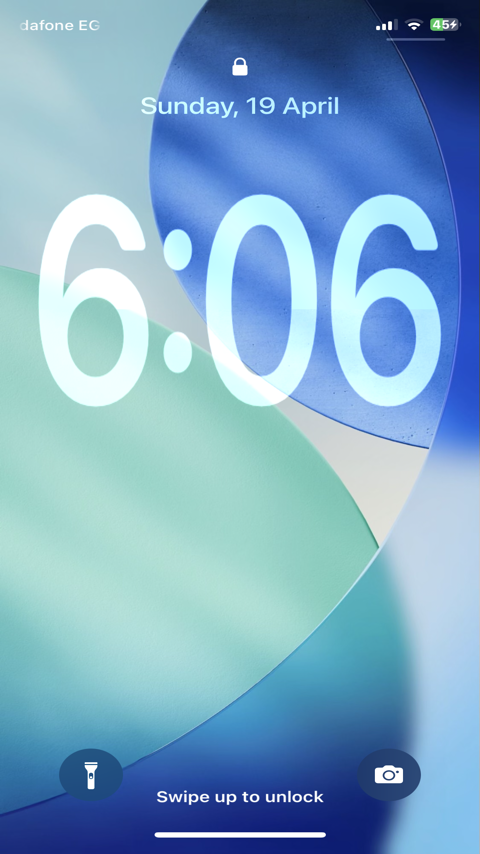
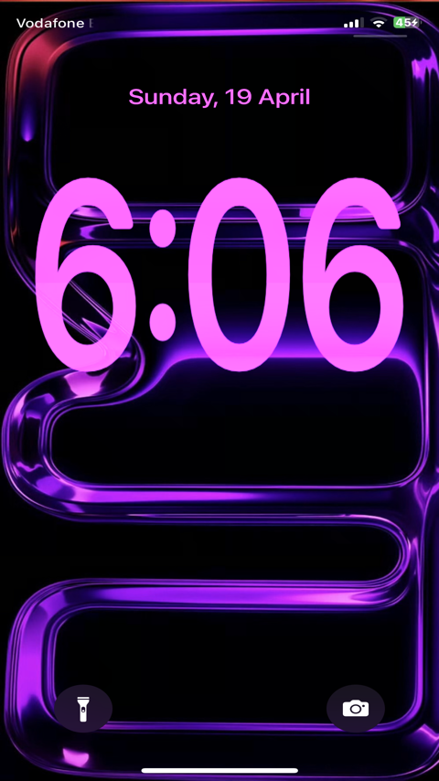
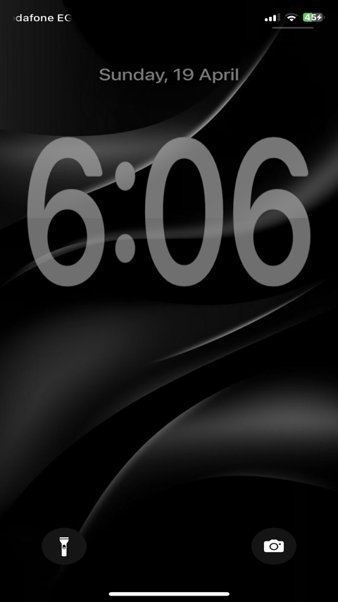
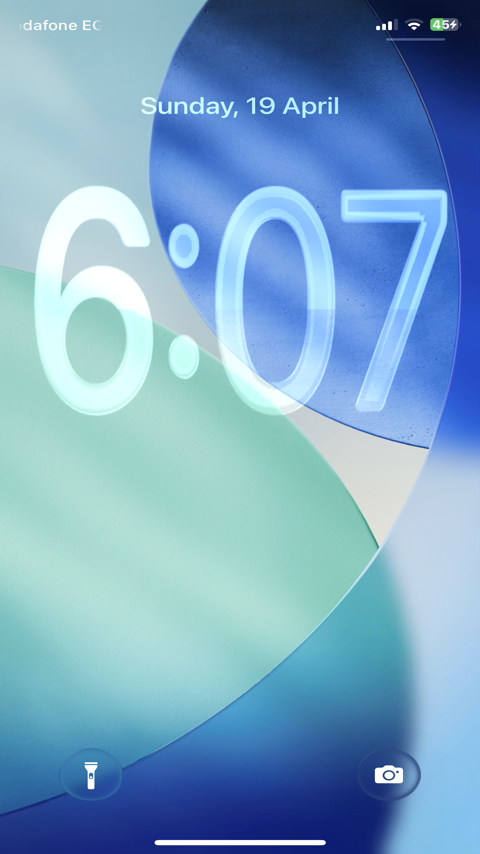
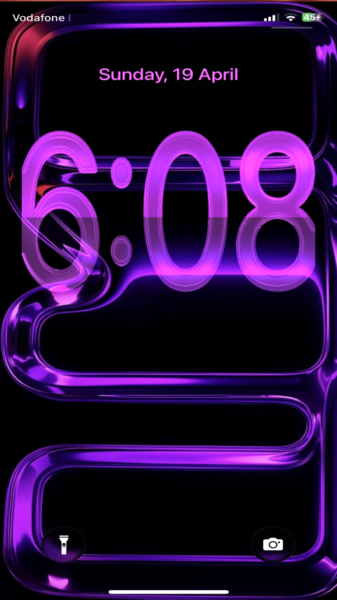
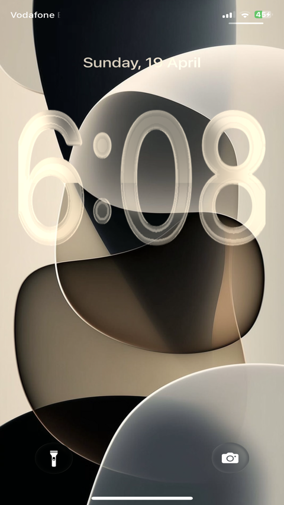

<code style="color : red">text</code>

# <code style="color : red">Note : beta version , use it on your risk</code>

- Note : beta version , use it on your risk

$$\color{red}{Note \space : \space beta \space version \space , \space use \space it \space at \space your \space risk}$$

# Note : beta version , use it on your risk

### LockXTime [Experimental]
Tweak to bring IOS26 time extend feature to old versions 

---------------

####  Features

-  X / Y axis stretching for Lock Screen clock
-  Real-time customization through preferences
-  Smooth UI transformation without lag
-  Instant apply without respring
-  Compatible with liquidAss tweak :

---

####  Preview 

---

####  Preview with [liquidass tweak](https://github.com/winaviation-tweaks/liquidass)

---

#### ⚙️ How It Works

This tweak hooks into the Lock Screen UI elements and modifies their transform values using UIKit/CALayer transformations, allowing controlled stretching on X and Y axes without breaking layout rendering.

---

#### 📦 Installation
download the deb from [Releases page](https://github.com/xien999/LockXTime/releases) and Install it via sileo

#### Requirements
- Jailbroken iOS device
- Compatible iOS version 14.0-17.0
